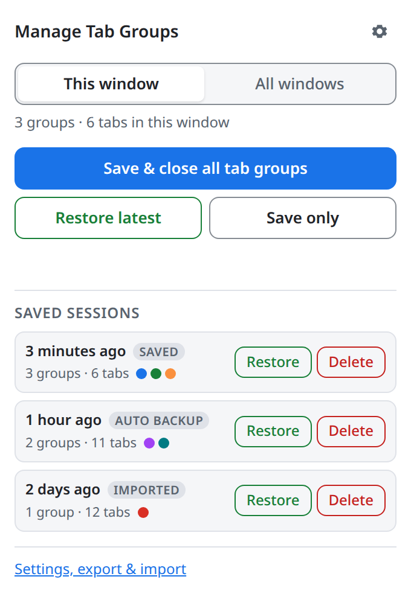
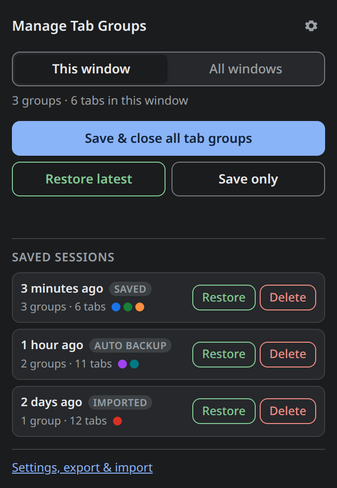
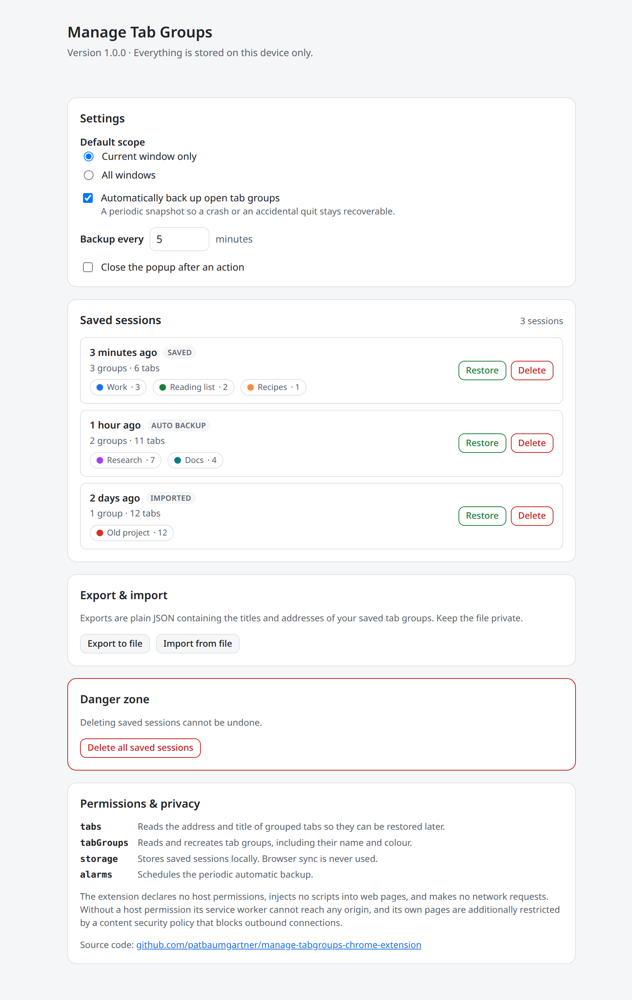

# Manage Tab Groups

[](https://github.com/patbaumgartner/manage-tabgroups-chrome-extension/actions/workflows/ci.yml)
[](https://github.com/patbaumgartner/manage-tabgroups-chrome-extension/actions/workflows/codeql.yml)
[](LICENSE)
[](https://github.com/patbaumgartner/manage-tabgroups-chrome-extension/releases/download/snapshot/manage-tabgroups-snapshot.zip)

Save and close **every tab group at once**, then bring them all back with **one
click**. A Manifest V3 extension for Chrome and other Chromium browsers, with no
runtime dependencies, no network access and no telemetry.

<p align="center">
  
</p>

---

## Why

Chromium browsers lose tab groups more often than they should: a crash, a
forced restart for an update, or a "close all windows" at the wrong moment, and
the groups are gone with no reliable way to bring them back.

This extension makes that recoverable:

1. It **saves before it closes** — a group is only closed once it is safely in
   local storage.
2. It **snapshots on a timer**, so an unexpected quit still leaves something to
   restore.
3. It **restores everything in one click**, with the original group names,
   colours, collapsed state and tab order.

## Features

- **Save & close all tab groups** in the current window or across every window.
- **Restore the latest session** — or any older one — with a single click.
- **Automatic backups** on a configurable interval (default: every 5 minutes),
  skipped when nothing changed.
- **Keyboard shortcuts** for closing and restoring, assignable at
  `chrome://extensions/shortcuts`.
- **Export and import** sessions as plain JSON, so backups can be moved between
  machines or profiles.
- **Never destroys what it cannot save**: ungrouped tabs are left alone, a tab
  whose address cannot be restored (`chrome://`, local files, and so on) is
  reported and left open rather than closed, and a tab that navigated while the
  snapshot was being written is left open too.
- **Never closes a window by accident**: if a group was the last thing in a
  window, a new tab page is opened before the group is closed.

## Install

**Three steps, about a minute.** No store account, no build tools.

<p align="center">
  <a href="https://github.com/patbaumgartner/manage-tabgroups-chrome-extension/releases/download/snapshot/manage-tabgroups-snapshot.zip"><b>⬇ Download manage-tabgroups-snapshot.zip</b></a>
  &nbsp;·&nbsp;
  <a href="https://github.com/patbaumgartner/manage-tabgroups-chrome-extension/releases/download/snapshot/manage-tabgroups-snapshot.zip.sha256">checksum</a>
  &nbsp;·&nbsp;
  <a href="https://github.com/patbaumgartner/manage-tabgroups-chrome-extension/releases/tag/snapshot">what is in this build</a>
</p>

1. **Download** the zip above and unzip it into a folder you will keep.
   The browser loads the extension from that folder on every start, so do not
   delete or move it afterwards.
2. **Open your extensions page** and switch on **Developer mode** (top right):

   | Browser | Address |
   | --- | --- |
   | Chrome | `chrome://extensions` |
   | Edge | `edge://extensions` |
   | Brave | `brave://extensions` |
   | Vivaldi | `vivaldi://extensions` |
   | Opera | `opera://extensions` |

3. **Click *Load unpacked*** and choose the unzipped folder. The icon appears in
   the toolbar immediately.

The download is the current tip of `main`, rebuilt on every push once lint,
types, tests, a real-browser run and a reproducible build have all passed. Its
release notes name the exact commit it came from.

<details>
<summary><b>Why is there no "Add to Chrome" button?</b></summary>

Browsers only install extensions on click from their own store, and this
extension is deliberately not published there: installing it unpacked means the
folder you load is readable source, identical to what is in this repository. The
trade-off is the three manual steps above, and that updates are manual too - see
[Updating](#updating).
</details>

<details>
<summary><b>Verify the download</b></summary>

The archive is built deterministically, so the checksum published beside it can
be reproduced from source with `npm run build`.

```bash
curl -LO https://github.com/patbaumgartner/manage-tabgroups-chrome-extension/releases/download/snapshot/manage-tabgroups-snapshot.zip
curl -LO https://github.com/patbaumgartner/manage-tabgroups-chrome-extension/releases/download/snapshot/manage-tabgroups-snapshot.zip.sha256
sha256sum -c manage-tabgroups-snapshot.zip.sha256
```
</details>

<details>
<summary><b>Other ways to get it</b></summary>

**Tagged releases.** No version has been tagged yet. Once one exists, the
[latest release](https://github.com/patbaumgartner/manage-tabgroups-chrome-extension/releases/latest)
carries `manage-tabgroups-<version>.zip` and its checksum; snapshots are marked
as pre-releases, so that link always resolves to a tagged version. Prefer a
tagged release for stability once one exists.

**From a clone.** There is no build step: the `extension/` folder in the
repository is exactly what the browser runs.

```bash
git clone https://github.com/patbaumgartner/manage-tabgroups-chrome-extension.git
```

Then *Load unpacked* → `manage-tabgroups-chrome-extension/extension`.

**A specific commit.** Every commit on every branch is packaged as a workflow
artifact on its [CI run](.github/workflows/ci.yml). Those need a GitHub login
and expire after 90 days.
</details>

### Updating

Chrome cannot update an unpacked extension by itself, so updating is manual but
quick: download the new zip, unzip it **over the same folder**, then click the
reload arrow on the extension's card on your extensions page. Your saved
sessions live in browser storage, not in the folder, so they survive.

To hear about new versions without the extension ever touching the network,
use **Watch → Custom → Releases** on this repository.

## Usage

Click the toolbar icon:

- **Save & close all tab groups** — stores every group in scope, then closes
  exactly the tabs it stored.
- **Restore latest** — recreates the most recent saved session in the current
  window.
- **Save only** — stores a snapshot without touching your tabs.
- **This window / All windows** — chooses the scope for the actions above.

The saved-session list shows each snapshot's age, size and group colours;
every entry can be restored or deleted individually.

The interface follows the browser's colour scheme:

| Light | Dark |
| --- | --- |
|  |  |

**Settings, export and import** live on the options page (the gear icon, or
right-click the toolbar icon → *Options*).

<p align="center">
  
</p>

### Keyboard shortcuts

Two commands ship without a default key so they cannot clash with anything you
already use. Assign them at `chrome://extensions/shortcuts`:

- *Save and close all tab groups*
- *Restore the most recently saved session*

After a shortcut runs, the toolbar badge briefly shows how many groups were
closed or restored (`!` if it failed).

## Permissions

| Permission   | Why it is needed                                                                     |
| ------------ | ------------------------------------------------------------------------------------ |
| `tabs`       | Read the address and title of grouped tabs so they can be recreated later.            |
| `tabGroups`  | Read and recreate tab groups, including their name, colour and collapsed state.       |
| `storage`    | Store saved sessions locally, in `chrome.storage.local`.                              |
| `alarms`     | Schedule the periodic automatic backup.                                               |

The extension declares **no host permissions**, injects **no content scripts**,
exposes **no web-accessible resources**, and has **no** `externally_connectable`
entry. Two separate mechanisms keep it off the network: a service worker can
only reach an origin it holds a host permission for, and there are none; and the
extension's own pages are additionally pinned by a content security policy of
`default-src 'none'` with `connect-src 'none'`.

These properties are asserted by [`scripts/validate-manifest.mjs`](scripts/validate-manifest.mjs),
which runs in CI and fails the build if any of them regresses.

## Privacy

Everything stays on the device. There are no analytics, no update pings and no
remote code. See [PRIVACY.md](PRIVACY.md) for the full statement, and
[SECURITY.md](SECURITY.md) for the threat model and how to report an issue.

Exported JSON files contain the titles and addresses of your saved tabs. Treat
them like browser history.

## Browser support

- **Declared minimum:** Chrome 114. That number is derived, not guessed:
  `chrome.alarms.create()` only returns a promise from Chrome 111, and the
  storage budget below assumes the 10 MB `chrome.storage.local` quota that
  arrived in Chrome 114. (`chrome.tabGroups` itself dates back to Chrome 89.)
- **Verified on:** Google Chrome 152 (Linux), by an automated run that installs
  the extension into a real browser and drives the popup — see
  [`scripts/e2e.mjs`](scripts/e2e.mjs).
- **Expected to work, not verified here:** Edge, Brave, Vivaldi, Opera and other
  Chromium browsers of a comparable version. No claim is made that they were
  tested.

If a browser does not expose `chrome.tabGroups`, the extension detects it at
runtime and says so instead of failing silently.

## Limitations

Stated plainly, because they affect how much you should rely on it:

- Automatic backups run on a timer. Groups created in the minutes before a crash
  may not be in the last snapshot. Use *Save only* before risky operations.
- Restored tabs load immediately; restoring a very large session takes memory
  and time, and tabs are recreated one at a time to preserve their order. There
  is no lazy restore, because Manifest V3 offers no supported way to create a
  discarded tab.
- Only `http` and `https` tabs are saved. Browser pages, extension pages,
  `file://` URLs and `data:` URLs are deliberately never restored, and therefore
  never closed either.
- Ungrouped and pinned tabs are never saved, closed or moved. They are read
  while scanning the window — the extension has to look at every tab to know
  which ones belong to a group, and to notice when closing a group would leave a
  window empty — but nothing about them is written to storage.
- Sessions are stored in `chrome.storage.local`, which is per-profile and not
  synced. Use export/import to move them.
- Storage is bounded: at most 25 manual and 10 automatic sessions are kept, and
  a single session is capped at 200 groups, 2000 tabs and 2 MB. These are upper
  bounds, not guarantees — if the browser's storage quota is reached first, the
  automatic backups are dropped to make room, and a save that still does not fit
  fails without closing anything.

## Development

Requires Node.js 20.11 or newer. There is no bundler and no runtime dependency —
the dev dependencies are only a type checker, a linter and type definitions.

```bash
npm ci
npm run check        # everything below except e2e: the gate CI runs
npm test             # unit tests only
npm run test:coverage  # unit tests with a line/branch/function report
npm run lint         # Biome, check-only (as CI runs it)
npm run lint:fix     # Biome, applying formatting and safe fixes
npm run typecheck    # tsc --noEmit over the JSDoc-typed sources
npm run validate     # manifest and source-level security assertions
npm run build        # reproducible dist/manage-tabgroups-<version>.zip + checksum
npm run e2e          # load the extension into a real Chrome and exercise it
npm run screenshots  # regenerate the images in docs/screenshots/
```

`npm run e2e` needs a Chromium binary on `PATH` (`google-chrome`, `chromium`, …)
and skips itself when none is found.

### Layout

```
extension/
  manifest.json      Manifest V3, four permissions, strict CSP
  background.js      Service worker: message router, alarms, commands
  src/
    constants.js     Limits, allowlists, message names
    model.js         Pure data model: build, validate, sanitize, prune
    settings.js      Pure settings normalization
    storage.js       chrome.storage.local access
    tabgroups.js     chrome.tabs / chrome.tabGroups / chrome.windows access
    actions.js       The operations the UI can trigger
    format.js        Pure presentation helpers
    dom.js           createElement-only DOM helpers
    messaging.js     Typed sendMessage wrapper
  popup/             One-click actions
  options/           Settings, session management, export and import
  styles/            Shared CSS custom properties and controls
scripts/
  validate-manifest.mjs  The security assertions CI enforces
  build.mjs              Reproducible packaging
  e2e.mjs                End-to-end run against a real browser
  screenshots.mjs        Regenerates the images in docs/screenshots/
  lib/                   Deterministic zip writer, shared DevTools harness
docs/screenshots/    README images, regenerated by npm run screenshots
tests/               node:test suites with an in-memory chrome API double
```

Untrusted input — page titles, stored JSON, imported files — only ever enters
the browser again through `extension/src/model.js`, which is pure and covered by
tests.

## Contributing

Bug reports and pull requests are welcome. Please read
[CONTRIBUTING.md](CONTRIBUTING.md) and the
[Code of Conduct](CODE_OF_CONDUCT.md) first.

## License

[MIT](LICENSE) © Patrick Baumgartner
